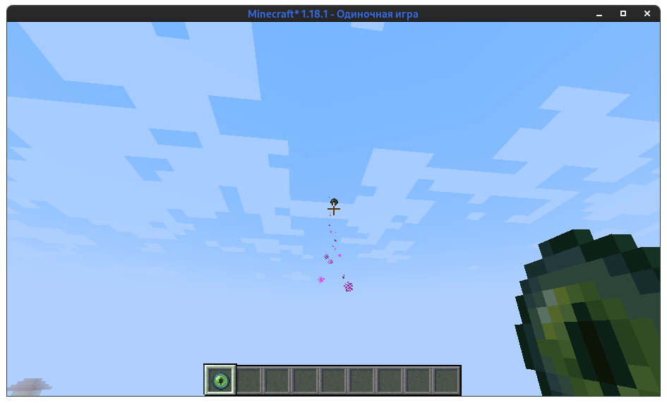
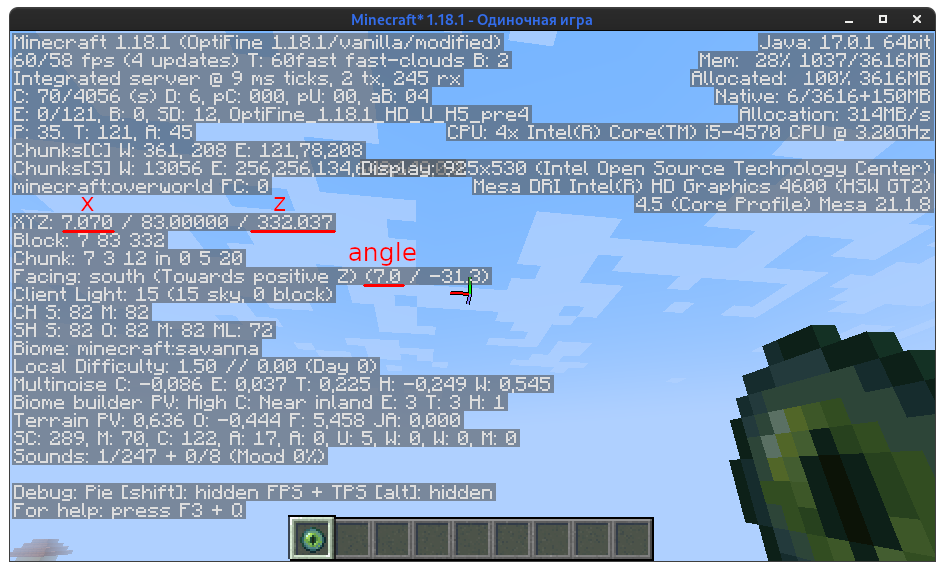

# End Portal Finder

This app calculates the coordinates of the portal to the end by 2 throws of ender pearl

## Usage

First cast eye of ender and look straight at it

 

Then press `F3` to open debug menu

Type this parameters in edit text

Move away from the first throw by 100-200 blocks

Then repeat this action with second eye of ender

## Credits

* [@IbremMiner837][IbremMiner837] - GUI and and other functional
* [@KirboGames][KirboGames] - Rewrite End Portal Calculator from https://skrepkaq.ru/stronghold
* [@skrepkaq][skrepkaq] - End Portal Calculator

[IbremMiner837]: https://github.com/IbremMiner837
[KirboGames]: https://github.com/KirboGames
[skrepkaq]: https://github.com/skrepkaq
